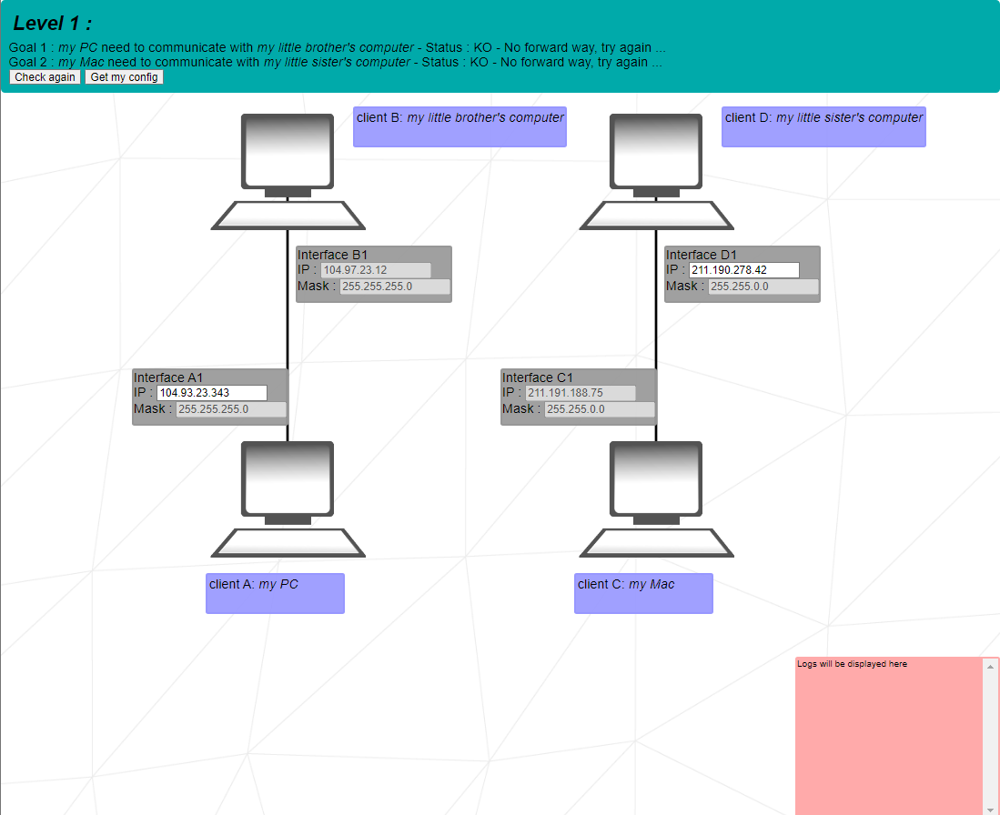
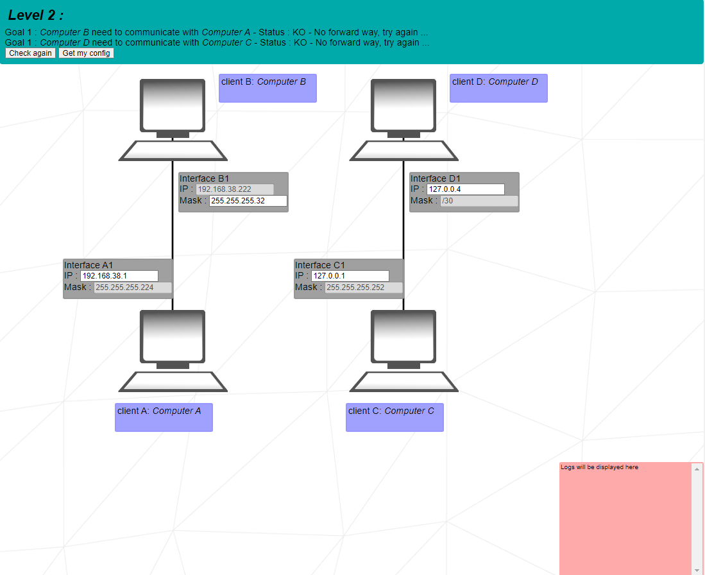
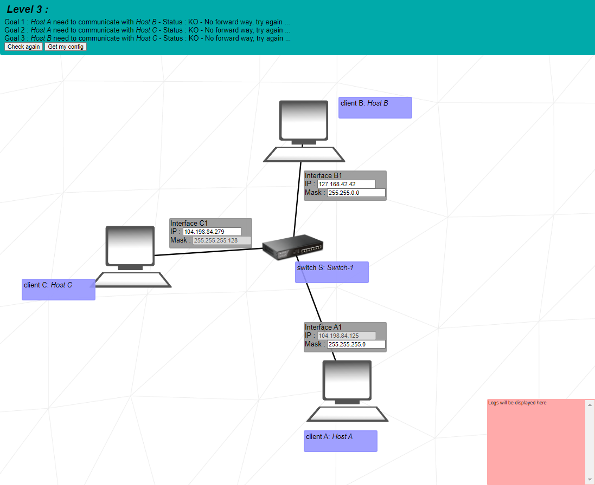
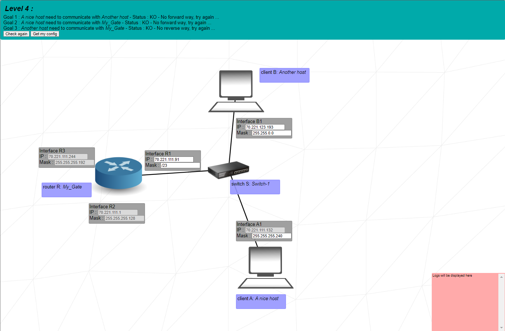
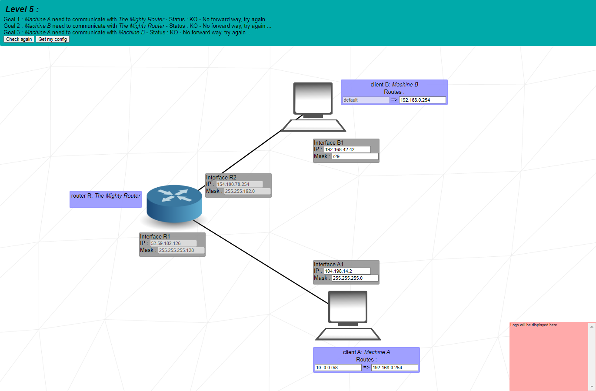
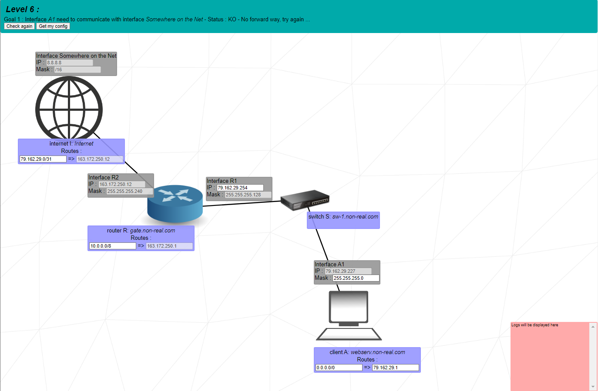
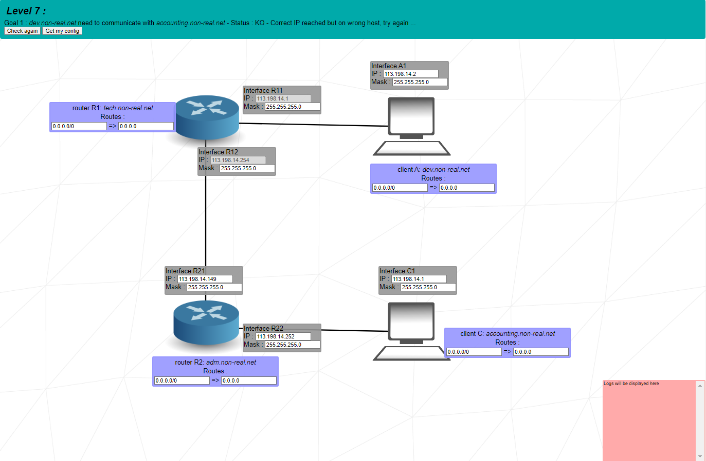
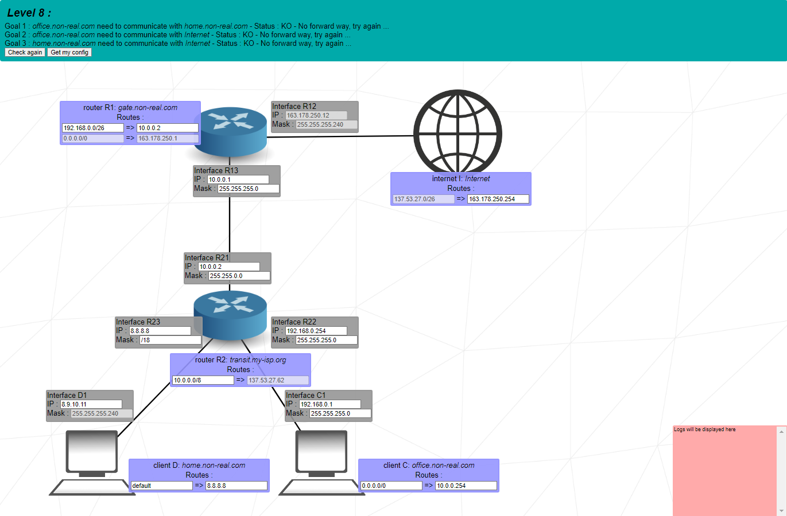
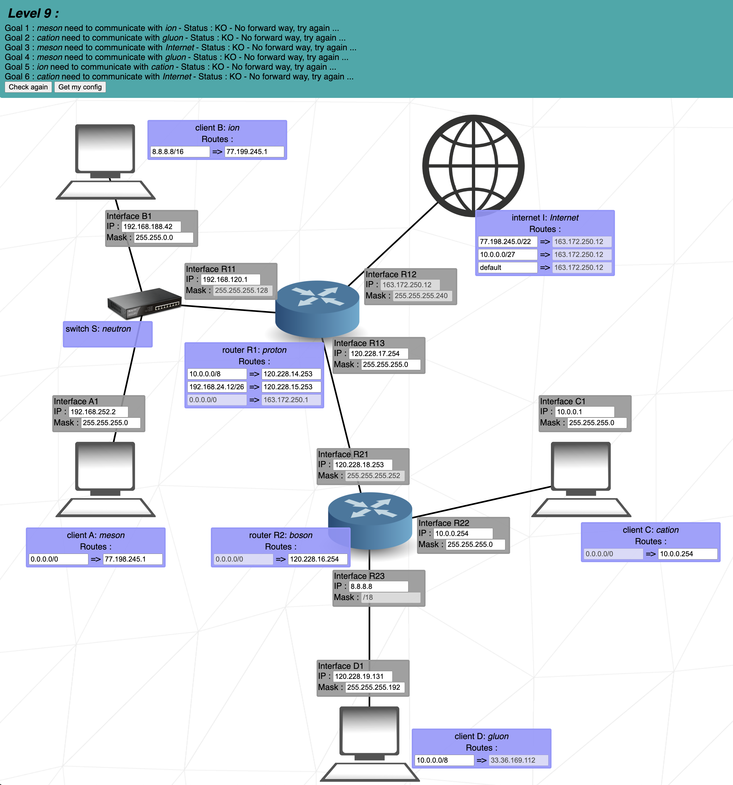
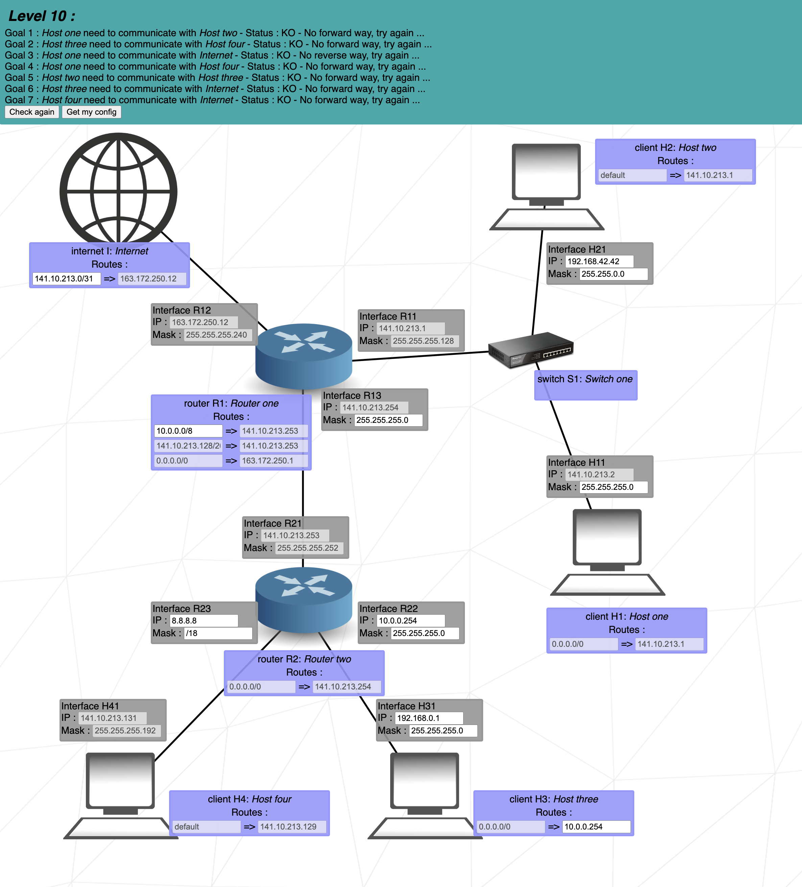

# NetPractice

This project is about solving 10 networking problems to make a network run. We will
configure small networks, but first we must know how networking and IP addresses
work.

> Also I would like to add a little disclaimer. I have no background or formal
> knowledge on networking and everything I have learned is through this project.
> If you find something wrong or you could explain something a bit further than I
> do, please I encourage you to open an issue or to submit a pull request.

## Basic concepts

### TCP

TCP stands for *Transmission Control Protocol*, and guarantees communication
integrity between network clients. It divides data in small packages and checks
that every one of them have been received without errors.

### IP

IP stands for *Internet Protocol*, and it's a logical way of addressing every
device in a network. An IP has two parts, one identifies the host and the other
represents the net to which it belongs. To separate them, we use **subnet
masks**.

There are 2 versions of IP, IPv4 (uses 32 bits to represent the address) and
IPv6 (uses 128 bits). The main difference is the number of devices they can
address, 2^32 vs 2^128. In this project, we will only work with IPv4 addresses.

### Subnet mask

The subnet mask is a 32 bit address, and as we said on the IP definition, we use
subnet masks to separate between network and host address. A valid subnet mask,
represented in binary, must have from 1 to 32 ones in a row at the beginning and
the rest must be zeros.

Some examples of valid network masks and their binary form:

| Network mask  | Binary form                         |
|---------------|-------------------------------------|
| 255.128.0.0   | 11111111.10000000.00000000.00000000 |
| 255.255.255.0 | 11111111.11111111.11111111.00000000 |

Another way of representing subnet masks is the **CIDR notation**. It represents
the address with `/number_of_ones_in_a_row`. For example, the addresses in the
table can also be represented with `/9` and `/24` respectively.

## How to calculate network and host address range

Given an IP and a subnet mask, we will represent them both in binary form:

|             | IP                                  | Network Mask                        |
|-------------|-------------------------------------|-------------------------------------|
| Address     | 104.198.241.125                     | 255.255.255.0                       |
| Binary form | 01101000.11000110.11110001.01111101 | 11111111.11111111.11111111.00000000 |

To obtain the **network IP**, we must AND both binary addresses, resulting in
`01101000.11000110.11110001.00000000` or `104.198.241.0`.

To calculate the host address range, we take the last octet, in this case its
`00000000`. The host addresses can range between `00000000` and `11111111`,
translated to our example, the IPs can range between `[104.198.241.0 -
104.198.241.255]`.

We didn't mention it before, but **the ends of the range are reserved
addresses** and can't be used. The lower end is reserved for the network IP and
the upper end is the broadcast address, so the effective range is
`[104.198.241.1 - 104.198.241.254]`.

# Project exercises

Now that we know the basics of how network elements work, we can start solving
the exercises. Also, we will be introducing new concepts and elements as they
appear in the exercises like routers, switches, etc.

## Level 1

  
Show level details

In this level, all we need to do is ensure that IP directions are in a valid
range, they have to be in the same network IP and we have to double check that
the IPs are valid and every value is between 0 and 255.

## Level 2

  
Show level details

This level is a bit tricky, because there are some considerations we haven't
taken before. For example, every host in a network should have the same subnet
mask (it's not strictly necessary as we are only *splitting the room in X
parts* and should be fine as long as there are no overlaps, but it's a good rule
to follow).

Also, when we talked about how both ends of the host IP ranges are reserved, we
should have added other reserved addresses like the ones for private networks.

The range `[127.0.0.1 - 127.255.255.255]` is reserved for localhost, and it allows
the computer to communicate with itself. One example that we have seen in the
cursus is in the Born2BeRoot project, in which we configure a web server and use
the localhost IP to connect to it.

## Level 3

  
Show level details

In this level, we see a switch for the first time. The switch allows us to
increase the number of the connected devices, but it doesn't have any interface,
it only distributes packages to its local network.

I like to think about it like a power strip, it connects multiple devices to a
common ground but it has no power until you plug it to an outlet.

For the next part, we have to calculate the IP addresses range given a subnet
mask. To do so, we take the subnet mask and invert it or sustract the zeros
part.

In this case, for 255.255.255.128 or `/25`, the range of valid IPs goes from
`(x.x.x.0 - x.x.x.127)` (x being the network address), so every connected device
is OK as long as it doesn't go out of this range and doesn't overlap with lower
and upper ends.

## Level 4

  
Show level details

In this level we see a router for the first time. A router is a device that
connects different networks and links them together. It has an interface and IP
for every network that it connects to.

The most important thing for this level is to keep in mind that interfaces R2
and R3 have nothing to do with the devices connected to R1, so we can treat them
independently and assign them any subnet mask.

The only consideration we need to have is that clients A1 and B1 should also
communicate with router's interfaces R2 and R3, so the IPs of these clients
should be in the range `(x.x.x.128 - x.x.x.192)`

## Level 5

  
Show level details

In this level we have to connect interfaces A1 and B1 together, but this time we
don't connect them directly together. We need to connect them through the router
interfaces, R1->A1 and R2->B1.

We put the clients masks in the same networks as their router interfaces and
configure a valid IP for each.

Now we see a new concept and a new field to configure that we haven't seen
before. The table we see in both clients is a routing table.

The **routing table** is a table that helps the router to find the target of the
packages and it's analogous to a distribution map in package delivery. The
routing table is the database that keeps track of all paths, like a map. To
complete this exercise, we need to fill two fields:

- Destination: it's the network address of the packet's final destination. If we
    put `default` or `0.0.0.0/0 ` on the destination, it will match any network.
    It's going to forward all the packets through the next hop.

- Next hop: it's the IP address of the next device in a network that a packet
    can go through.

In client B, the destination matches the default network, so in this case we
need to configure the next hop to be the router interface IP.

In client A, our next hop should also be the router interface IP, but we are
free to choose the destination address. We can do the same as in client B and
introduce the default address or we can introduce the client B address in the
format `x.x.x.x/net_mask`, it works in both ways.

## Level 6

  
Show level details

In this level, we see the internet for the first time, but it works the same way
as a router. The destination of the internet packages must match the client A IP
and netmask.

The router R connects to the internet through interface R2, which we don't have
to modify, but we have to modify the destination of the routing table to match
the default address as destination.

We can't modify the next hop of the router, but just so you know, that address
is the gateway address, the *door* that takes us from our home to the internet.

For the next part, we have to find the network address and configure the IP of
the R1 and A1. The following thing to do is to configure the routing table of
client A.

In the destination, we can put the default address or the internet address, and
in the next hop we have to introduce the IP of the interface R1.

## Level 7

  
Show level details

In this level, we have to connect client A to client C through routers R1 and
R2. We must arrange the devices in 3 subnets, one for Interface A1 and Interface
R11, another one for interfaces R12 and R21, and the last one for interfaces R22
and C1.

Once we created all the subnets and assigned every interface to its pair, we
need to configure the routing tables of both clients and routers.

Router R1 will forward all its upcoming packets to interface R21, and Router R2
will forward all its upcoming packets to interface R12.

Now for the last part, we must configure Client A and Client C tables. The
destination of Client A is Client C IP's, and viceversa, and their next hop is
the interface that connects to the router.

## Level 8

  
Show level details

For this level, we need to match interfaces D1-R23, C1-R22, R21-R13 and R-12 to
the internet.

As the Interface R12 has a fixed IP, the next hop of the internet routing table
has to be this IP.

The next thing we have to do is to place R13 and R21 in the same net. First, we
see that the next hop address of router R2 is fixed, so this must be the IP of
the interface R13.

For interface R21, we can choose any IP as long as it's in the IP range of R13,
and we have to place it as the next hop IP of router R1.

Now we should configure Router R2 and clients C and D. Interfaces R22 and R23
must have their own subnet, so they don't overlap with any other interface of
this router, and then interfaces D1 and C1 must be in the same subnet as the
router interface that they are connected to.

The clients C and D destination must be the default one, and the next hop has to
be the same as their router interfaces.

## Level 9

  
Show level details

## Level 10

  
Show level details

